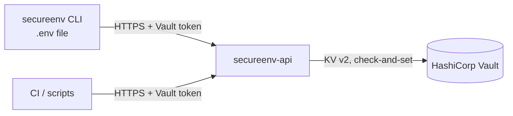

# SecureEnv

SecureEnv keeps project environment variables in [HashiCorp Vault](https://developer.hashicorp.com/vault) and synchronises them with local `.env` files, like git does for code.

It has two parts:

- **`secureenv`**, a CLI to `pull`, `push` and inspect the variables of a project.
- **`secureenv-api`**, an HTTP API in front of Vault's KV v2 engine. Each caller brings their own Vault token, so Vault policies decide who can read or change what.

## How does it work?



- Each **project** is one KV v2 secret, and its **variables** are the key/value pairs of that secret. Vault keeps every version.
- Every write uses check-and-set: if two people push at the same time, the second one gets a conflict instead of silently erasing the first one's changes.
- Local `SECURE_ENV_*` entries (project name, API URL, token) configure the CLI and are never sent to Vault.

See [docs/architecture.md](docs/architecture.md) for the code design and [docs/api.md](docs/api.md) for the HTTP API.

## Getting Started

### Installation

Requires Go 1.26+.

```bash
go install github.com/PoCInnovation/SecureEnv/cmd/secureenv@latest
```

or from a clone: `make build` puts `secureenv` and `secureenv-api` in `bin/`.

### Quickstart

Start a local Vault dev server and the API (requires Docker):

```bash
make dev-up
export SECURE_ENV_API_URL=http://127.0.0.1:8080
export SECURE_ENV_TOKEN=dev-root   # dev only, use a scoped token otherwise
```

In any git repository:

```bash
secureenv init                 # links .env to a project named after the git origin, e.g. PoCInnovation_SecureEnv
secureenv project create       # creates that project
echo 'DATABASE_URL="postgres://localhost/app"' >> .env
secureenv push                 # sends local variables
secureenv status               # compares .env with the project
```

A teammate then runs `secureenv clone PoCInnovation_SecureEnv` to get the same `.env`.

### Usage

```text
secureenv [-api URL] [-project NAME] [-file PATH] <command>

  init [project]          link the local env file to a project
  clone [project]         init, then pull
  status                  show local (+), modified (~) and remote only (-) variables
  pull [-force]           write the project variables into .env (keeps SECURE_ENV_* entries)
  push [-force]           replace the project variables with .env
  project list|create|info|rename|delete
  var list [-values] | get <key> | set <key> [value] | unset <key>
  version
```

- `pull` refuses to overwrite local changes that were not pushed, and `push` refuses to delete remote variables missing from `.env`. Use `-force` to go ahead anyway.
- `var set KEY` without a value reads it from stdin, so the secret stays out of your shell history.
- Settings are resolved in this order: flag, then environment variable, then `.env`, then default:

| Setting | Flag | Variable | Default |
|---|---|---|---|
| API URL | `-api` | `SECURE_ENV_API_URL` | `http://127.0.0.1:8080` |
| Vault token | | `SECURE_ENV_TOKEN`, then `VAULT_TOKEN` | required |
| Project | `-project` | `SECURE_ENV_PROJECT` | derived from the git `origin` remote |

### Running the API

The API is configured through environment variables. Vault connection settings use the standard `VAULT_*` variables (`VAULT_ADDR`, `VAULT_CACERT`, ...).

| Variable | Default | Description |
|---|---|---|
| `SECURE_ENV_LISTEN_ADDR` | `:8080` | listen address |
| `SECURE_ENV_VAULT_MOUNT` | `secret` | KV v2 mount path |
| `SECURE_ENV_VAULT_PREFIX` | *(empty)* | folder holding projects in the mount, `secureenv` in the provided deployments |
| `SECURE_ENV_TLS_CERT_FILE` / `SECURE_ENV_TLS_KEY_FILE` | | serve HTTPS directly |
| `SECURE_ENV_LOG_LEVEL` | `info` | `debug`, `info`, `warn`, `error` |

The API ignores `VAULT_TOKEN`: it never acts with its own identity. For a production setup (TLS, integrated storage, audit logs, least-privilege policies), see [deploy/README.md](deploy/README.md).

### Development

```bash
make test               # unit and end-to-end tests with the race detector
make lint               # golangci-lint
make dev-up && make test-integration   # store contract against a real Vault
make fuzz               # fuzz the .env parser
```

## Get involved

You're invited to join this project ! Check out the [contributing guide](./CONTRIBUTING.md).

If you're interested in how the project is organized at a higher level, please contact the current project manager.

## Our PoC team ❤️

Developers
| [<br><sub>Vahan Ducher</sub>](https://github.com/vahand) | [<br><sub>Gatien Rittner</sub>](https://github.com/grittner) | [<br><sub>Antonin Leprest</sub>](https://github.com/Matribuk) | [<br><sub>Adam Deziri</sub>](https://github.com/adamdeziri)
|:---:|:---:|:---:|:---:|

Manager
| [<br><sub>Reza Rahemtola</sub>](https://github.com/RezaRahemtola)
| :---: |

<h2 align=center>
Organization
</h2>

<p align='center'>
    <a href="https://www.linkedin.com/company/pocinnovation/mycompany/">
        
    </a>
    <a href="https://www.instagram.com/pocinnovation/">
        
    </a>
    <a href="https://twitter.com/PoCInnovation">
        
    </a>
    <a href="https://discord.com/invite/Yqq2ADGDS7">
        
    </a>
</p>
<p align=center>
    <a href="https://www.poc-innovation.fr/">
        
    </a>
</p>

> 🚀 Don't hesitate to follow us on our different networks, and put a star 🌟 on `PoC's` repositories

> Made with ❤️ by PoC
