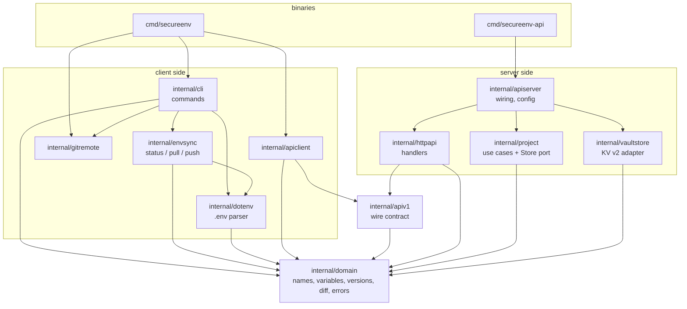

# Architecture

SecureEnv is one Go module with two binaries. The code follows a hexagonal layout: the domain and the use cases in the middle know nothing about HTTP, Vault or files, and adapters around them plug into small interfaces.

`internal/archtest` enforces these arrows: a new import that breaks them fails the build.

## Packages

| Package | Responsibility |
|---|---|
| `domain` | Validated `ProjectName` and `VariableKey`, immutable `Variables`, `Version`/`Snapshot`, `Diff`, and the sentinel errors every layer shares. No dependencies. |
| `project` | Use cases (create, rename, set a variable, replace all variables...) over the `Store` port. Handles validation, check-and-set retries and rename rollback. |
| `vaultstore` | `Store` on Vault KV v2 through the official `vault/api` client. Maps Vault errors to domain errors. `WithToken` clones the client for a caller. |
| `apiv1` | Request/response types and the single table mapping domain errors to HTTP status codes and stable error codes. Shared by server and client. |
| `httpapi` | Standard library router, bearer token extraction, strict JSON decoding, ETag/If-Match, request logs. Depends on a `ProjectService` interface, not on `project`. |
| `apiserver` | Composition root of the API: configuration, Vault client, lifecycle with graceful shutdown. |
| `apiclient` | Typed HTTP client; errors unwrap to domain errors. |
| `dotenv` | `.env` parsing and atomic, `0600` writing. |
| `envsync` | Local vs remote comparison and the safety rules of pull and push. |
| `gitremote` | Default project name from the git `origin` remote. |
| `cli` | Command tree, settings resolution and output. Dependencies (API factory, git, I/O) are injected through `cli.Env`. |

## Key decisions

**Callers authenticate with their own Vault token.** The previous API used one hardcoded token for every request. The API now forwards the caller's token, so Vault policies and audit logs apply per user, and the API has no secret of its own.

**Check-and-set on every write.** Vault KV v2 supports optimistic concurrency. Creating a project writes with `cas=0`, and updates write with the version that was read. Concurrent changes become `ErrVersionConflict` (HTTP 412) instead of lost updates. Single-variable updates retry a few times, and `push` exposes the conflict so the user can review it.

**Errors are values from the domain.** Adapters wrap `domain.Err*` sentinels (`fmt.Errorf("%w: %w", domain.ErrProjectNotFound, err)`), `apiv1` maps them to HTTP in one table, and the client unwraps them back. `errors.Is` works the same on both sides of the network.

**Interfaces are declared by their consumers.** `project.Store`, `httpapi.ProjectService`, `envsync.Remote` and `cli.API` each list only what their package needs, which keeps coupling low and makes test doubles trivial.

**MySQL was removed.** It only stored a copy of project names and an action log keyed on a spoofable `X-Forwarded-For` header. Vault already knows the projects, and its audit devices record every operation together with the token that performed it.

## Testing strategy

- **Unit tests** cover each package with table-driven tests. The `.env` parser also has a round-trip fuzz test.
- **Contract tests** (`project/storetest`) describe the `Store` behaviour once and run against the in-memory store, an HTTP emulator of Vault, and a real Vault (`-tags integration`, run in CI).
- **End-to-end tests** drive the API client and the CLI against the real HTTP handler and service backed by `projecttest.MemStore`.
- **Architecture test** checks package dependencies.
